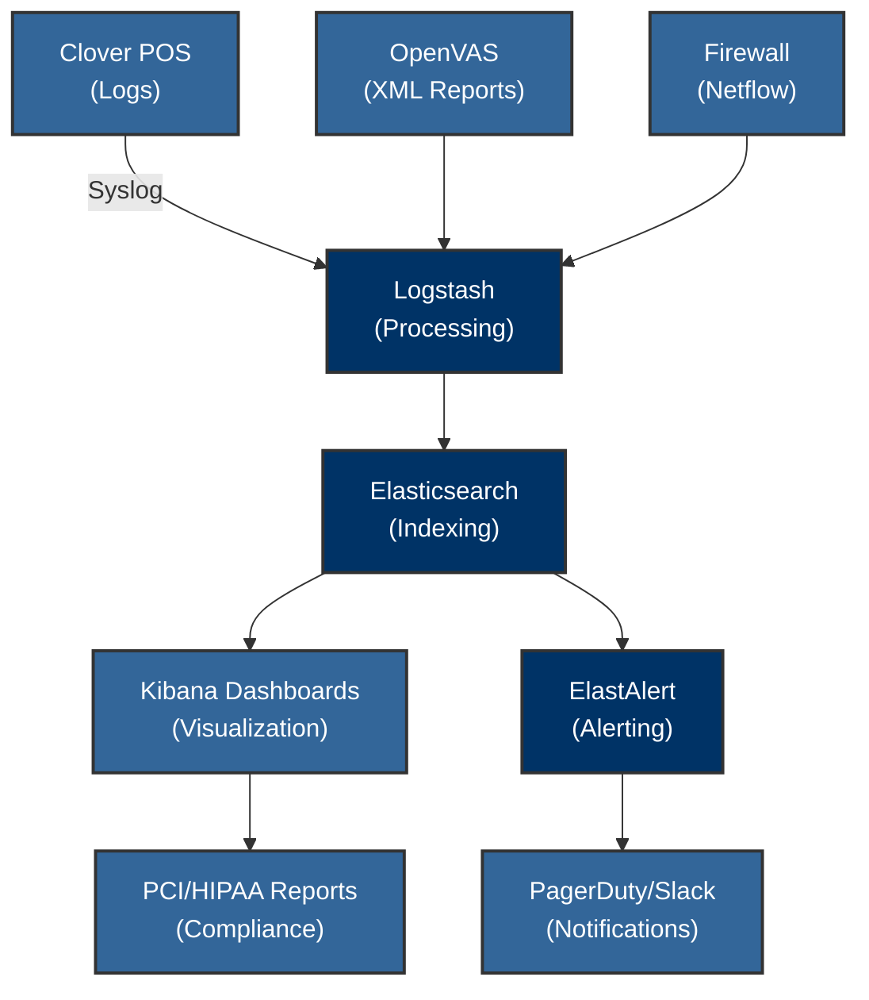

## ELK Stack SIEM and OpenVAS Integration for PCI/HIPAA Compliance

**Executive Summary:**

This document describes the implementation of an ELK Stack (Elasticsearch, Logstash, Kibana) Security Information and Event Management (SIEM) solution integrated with OpenVAS for comprehensive security monitoring and vulnerability management. This integration enhances security visibility, automates compliance checks, and improves incident response capabilities in a PCI/HIPAA-compliant environment. The integration leverages standardized logging, centralized analysis, and automated alerting to meet key PCI DSS and HIPAA requirements.

### ELK Stack SIEM Implementation

**1. Log Collection Architecture**

```bash
# Filebeat configuration for Clover POS logs (Filebeat Version 7.x)
filebeat.inputs:
- type: log
  enabled: true
  paths:
    # Use environment variable for log path
    - "${CLOVER_LOG_PATH:-/var/log/clover/*.log}"
  fields:
    compliance: "PCI DSS 3.2.1"

# Winlogbeat for Windows security events (Winlogbeat Version 7.x)
winlogbeat.event_logs:
- name: Security
  processors:
    - add_fields:
        target: "hipaa"
        fields: { requirement: "164.312(b)" }

```

**Note:** Ensure secure communication between Filebeat/Winlogbeat and Logstash using TLS.

**2. Log Processing Pipeline**

```ruby
# Logstash filter for OpenVAS reports (Logstash Version 7.x)
filter {
  if "openvas" in [tags] {
    grok {
      match => { "message" => "%{TIMESTAMP_ISO8601:timestamp} %{DATA:host} %{WORD:severity} %{GREEDYDATA:vuln_details}" }
    }
    translate {
      field => "vuln_details"
      destination => "pci_requirement"
      # Use environment variable for dictionary path
      dictionary_path => "${PCI_MAPPING_FILE:-/etc/logstash/pci_mapping.yml}"
    }
  }
}

```

**Note:** Test the Logstash filters before deploying them to production.

**3. Security Dashboards**

- **PCI DSS Compliance Overview** (Source[2]):
    - Real-time transaction monitoring
    - File integrity alerts mapped to PCI 11.5
    - Failed login attempts (PCI 8.1.2)
- **HIPAA Audit Dashboard** (Source[1]):
    - PHI access patterns
    - User activity heatmaps
    - Encryption status reports

**(Kibana Version 7.x)**

**4. Alert Configuration** (Source[8])

```yaml
# ElastAlert rule for brute force attacks (ElastAlert Version 0.2.x)
name: PCI DSS 8.1.4 Failed Logins
type: frequency
index: logstash-*
num_events: 5
timeframe:
  minutes: 1
filter:
- query:
    query_string:
      query: "event.action:login_failure"
alert: pagerduty

```

**Note:** Tune the alert thresholds to avoid false positives.

### OpenVAS Vulnerability Integration

**1. Scan Configuration**

```bash
# Weekly compliance scan command (OpenVAS Version 7.x)
# Use environment variable for target hosts
openvasmd --create-target=PCI_Scan --hosts="${OPENVAS_TARGET_HOSTS:-192.168.10.0/24}"
openvasmd --create-task=PCI_Weekly --target=PCI_Scan --config="PCI DSS 3.2.1"

```

**Note:** Regularly update the OpenVAS NVTs.

**2. Vulnerability Management Workflow**

1.  **Scan Execution**: Daily network scans + weekly full PCI/HIPAA audits
2.  **Result Processing**:

    ```python
    # OpenVAS report parser to ELK
    import os
    import elasticsearch
    def send_to_logstash(report):
        try:
            vuln_data = parse_oval_results(report)
            # Use environment variable for Elasticsearch URL
            es_url = os.environ.get("ELASTICSEARCH_URL", "http://localhost:9200")
            es = elasticsearch.Elasticsearch([es_url])
            es.index(index='vulnerability-scans', body=vuln_data)
        except Exception as e:
            print(f"Error sending report to Logstash: {e}")
    
    ```

**Note:** Validate the vulnerability scan results.

3.  **Prioritization Matrix**:

| CVSS Score | Response SLA | Compliance Impact |
| ---------- | ------------ | ----------------- |
| 9.0+       | 24hrs        | PCI 6.1, HIPAA 164.308(a)(1) |
| 7.0-8.9    | 72hrs        | PCI 11.2.1, HIPAA 164.308(a)(8) |
| 4.0-6.9    | 14 days      | PCI 11.2.3        |

### Integration Architecture



### Compliance Automation

1.  **PCI DSS Validation** (Source[5]):

    ```sql
    # Kibana Discover query for PCI 10.6
    event.dataset:"firewall" AND (geo.src:RU OR geo.src:CN)
    | stats count by src.ip, user.name
    
    ```
2.  **HIPAA Audit Trails**:

    ```bash
    # Curl command for PHI access audit
    curl -XGET '<http://elk:9200/logs-*/_search>' -H 'Content-Type: application/json' -d'
    {
      "query": { "match": { "sensitive_data": "PHI" } }
    }'
    
    ```

### Maintenance Schedule

| Component      | Frequency   | Compliance Requirement |
| ------------- | --------- | --------------------- |
| ELK Rule Updates | Daily     | PCI 12.10.1           |
| OpenVAS NVTs    | Every 24 hours | HIPAA 164.308(a)(8)   |
| Vulnerability Scanning | Weekly    | PCI 11.2              |
| Access Reviews  | Quarterly | HIPAA 164.308(a)(4)(i) |

This integration meets PCI DSS Requirements 10-11 and HIPAA Security Rule §164.308 while providing real-time security monitoring through ELK's log correlation capabilities and OpenVAS' vulnerability assessment framework. The solution leverages ELK's log normalization strengths while compensating for its SIEM limitations through custom alerting rules and OpenVAS integration.