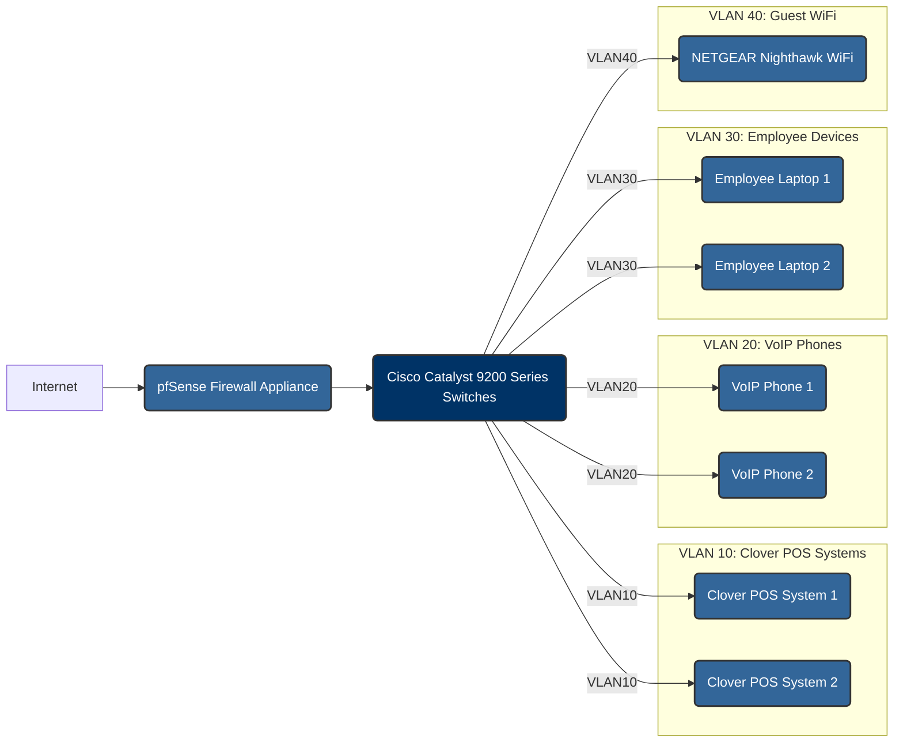

## Network Segmentation

**Executive Summary:**

This document describes the implementation of network segmentation to isolate sensitive systems and reduce the scope of PCI DSS and HIPAA compliance. This segmentation enhances network security, protects sensitive data, and ensures compliance with PCI DSS and HIPAA requirements by preventing unauthorized access, detecting and blocking malicious traffic, and providing real-time security monitoring.

**Technologies Used:**

*   Cisco Catalyst 9200 Series Switches
*   NETGEAR Nighthawk Modem Router Combo C7000
*   pfSense Firewall Appliance

### Segmentation Strategy

| VLAN ID | Purpose | Security Controls | Compliance Alignment |
| --- | --- | --- | --- |
| 10 | Clover POS Systems | MAC filtering, FIPS 140-2 encryption | PCI DSS Req 1, 3 |
| 20 | VoIP Phones | SRTP/SIP TLS encryption, QoS prioritization | HIPAA §164.312(e) |
| 30 | Employee Devices | 802.1X authentication, EAP-TLS | PCI DSS Req 8.3.1 |
| 40 | Guest WiFi | Captive portal, client isolation | PCI DSS Req 1.2.3 |

**Critical Configuration Requirements:**

*   Port security on all switch interfaces.
*   Private VLANs for payment systems to prevent lateral movement.
*   DHCP snooping on guest network VLANs.
*   PVLAN Edge on employee devices to isolate POS terminals.

**Configuration Examples:**

```bash
vlan 10
 name POS_Systems
vlan 20
 name VoIP_Phones
vlan 30
 name Employee_WiFi
vlan 40
 name Guest_Network
```

**Firewall Rules:**

*   Allow only necessary traffic between VLANs.
*   Block all traffic from the Guest WiFi VLAN to the internal network.
*   Implement strict access controls for traffic to and from the POS VLAN.

**Network Diagram:**

